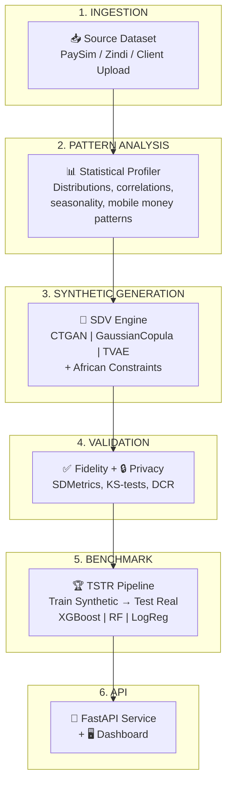

# 🌍 Synthara — Synthetic Data Engine for African Financial AI

> Generate statistically faithful synthetic datasets calibrated on African mobile money, microfinance, and informal economy patterns — enabling fintechs to train reliable ML models without compromising privacy.

## 🎯 The Problem

African fintechs and digital banks lack sufficient historical data to train performant credit scoring and fraud detection models. Existing synthetic data solutions are calibrated on Western financial behaviors (bank accounts, regular salaries) and don't reflect local realities: **mobile money**, **informal economy**, **irregular/seasonal income**.

**Synthara bridges this gap** by learning the statistical patterns of African financial data and generating unlimited synthetic datasets that preserve these patterns.

## 🏗️ Architecture



## 🚀 Quick Start

### 1. Setup

```bash
cd synthara
python -m venv venv
venv\Scripts\activate        # Windows
# source venv/bin/activate   # Linux/Mac

pip install -r requirements.txt
```

### 2. Download PaySim Dataset

```bash
python scripts/download_paysim.py
```

### 3. Run the Full Pipeline

```bash
python scripts/run_pipeline.py --nrows 50000
```

This will:
1. **Analyze** the source dataset patterns
2. **Generate** synthetic data with CTGAN
3. **Validate** fidelity and privacy
4. **Benchmark** ML models (TSTR)
5. **Produce** visualizations and reports

### 4. Individual Modules

```bash
# Analyze patterns
python -m src.data_analysis.profiler data/source/paysim.csv --nrows 100000

# Detect African-specific patterns
python -m src.data_analysis.african_patterns data/source/paysim.csv --nrows 100000

# Generate synthetic data
python -m src.generation.synthesizer data/source/paysim.csv --model ctgan --nrows 50000

# Evaluate fidelity
python -m src.validation.fidelity data/source/paysim.csv data/generated/synthetic_output.csv

# Run TSTR benchmark
python -m src.benchmark.tstr data/source/paysim.csv data/generated/synthetic_output.csv
```

## 📊 Key Metrics

| Metric | Description | Target |
|--------|-------------|--------|
| **Fidelity Score** | How closely synthetic data matches real distributions | > 0.85 |
| **Privacy Score** | Protection against re-identification (DCR) | > 0.85 |
| **TSTR ROC-AUC** | Fraud detection model trained on synthetic, tested on real | > 0.90 |
| **TSTR F1-Score** | Balanced precision/recall on real test data | > 0.50 |

## 🗂️ Project Structure

```
synthara/
├── src/
│   ├── data_analysis/          # Statistical profiling + African pattern detection
│   │   ├── profiler.py         # Automated dataset profiling
│   │   ├── african_patterns.py # Mobile money & seasonality patterns
│   │   └── visualizer.py       # Comparative visualizations
│   ├── generation/             # Synthetic data generation
│   │   ├── synthesizer.py      # Unified SDV wrapper (CTGAN/GCopula/TVAE)
│   │   ├── constraints.py      # African business rules enforcement
│   │   └── config.py           # Configuration loader
│   ├── validation/             # Quality assurance
│   │   ├── fidelity.py         # Statistical fidelity (KS, SDMetrics)
│   │   ├── privacy.py          # Anti re-identification (DCR)
│   │   └── reporter.py         # Report generation
│   ├── benchmark/              # ML model comparison
│   │   ├── tstr.py             # Train-Synthetic-Test-Real pipeline
│   │   ├── models.py           # XGBoost, RandomForest, LogReg
│   │   └── evaluator.py        # Metrics computation
│   └── api/                    # FastAPI service (Phase 2)
├── data/
│   ├── source/                 # Source datasets
│   └── generated/              # Synthetic outputs
├── configs/                    # YAML configurations
├── scripts/                    # Pipeline scripts
└── tests/                      # Unit tests
```

## 🔬 Technical Choices

| Component | Choice | Rationale |
|-----------|--------|-----------|
| Generation | **SDV** (CTGAN + GaussianCopula + TVAE) | Most mature open-source library for tabular synthetic data |
| Evaluation | **SDMetrics** + custom KS/JS tests | Comprehensive statistical evaluation |
| Benchmark | **XGBoost** + scikit-learn | State-of-the-art for tabular classification |
| API | **FastAPI** | Async, auto-documented, production-ready |
| Constraints | Custom post-processing | Enforces African mobile money business rules |

## ⚠️ Important Notes

- **PaySim is itself synthetic data** — for the PoC we demonstrate Synthara can learn and reproduce its patterns. Production clients will provide their own real data.
- **Class imbalance** — fraud rate in PaySim is ~0.13%. Models use balanced class weights and appropriate metrics (ROC-AUC, F1).
- **Privacy by design** — DCR (Distance to Closest Record) is computed systematically to ensure no synthetic record is too close to a real one.

## 📜 License

Proprietary — Synthara © 2026
